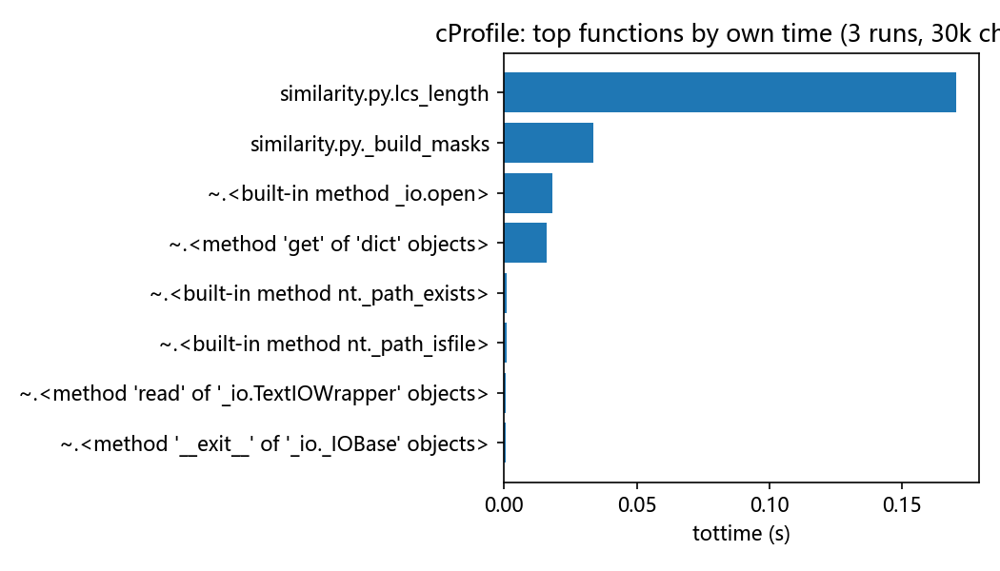
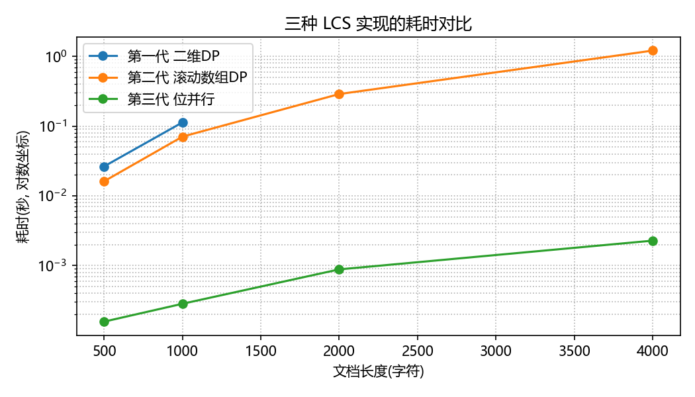

作业 GitHub 链接：https://github.com/Siruetto/liuhaobin

# 个人项目：论文查重

> **学号文件夹**：仓库根目录下的 `3124004477/`
>
> **实现语言**：Python 3（入口 `main.py`，运行仅依赖标准库，`requirements.txt` 只列测试与开发工具）
>
> **质量指标**：flake8 0 警告；45 个单元测试全部通过；4 个源文件分支覆盖率 100%

## 一、PSP 表格（开发前的预估）

PSP2.1 表格的完整版（预估 + 实际）见 [`docs/PSP.md`](PSP.md)，这里只列出开发前填写的预估值：

| PSP2.1 | Personal Software Process Stages | 预估耗时（分钟） |
| --- | --- | --- |
| Planning | 计划 | 15 |
| · Estimate | · 估计这个任务需要多少时间 | 15 |
| Development | 开发 | 275 |
| · Analysis | · 需求分析（包括学习新技术） | 30 |
| · Design Spec | · 生成设计文档 | 20 |
| · Design Review | · 设计复审 | 15 |
| · Coding Standard | · 代码规范 | 10 |
| · Design | · 具体设计 | 30 |
| · Coding | · 具体编码 | 90 |
| · Code Review | · 代码复审 | 20 |
| · Test | · 测试 | 60 |
| Reporting | 报告 | 50 |
| · Test Report | · 测试报告 | 20 |
| · Size Measurement | · 计算工作量 | 10 |
| · Postmortem & Process Improvement Plan | · 事后总结，并提出过程改进计划 | 20 |
| | **合计** | **340** |

## 二、计算模块接口的设计与实现过程

### 2.1 需求与对外接口

程序从命令行接收三个绝对路径，把重复率写到答案文件里：

```
python main.py <原文文件> <抄袭版论文文件> <答案文件>
```

答案文件的内容是一个精确到小数点后两位的浮点数，例如 `89.12`。

### 2.2 代码的组织：四个模块，各管一件事

| 文件 | 职责 | 关键函数 |
| --- | --- | --- |
| `main.py` | 命令行入口，串起整个流程，把异常翻译成退出码 | `main(argv)`、`compute_rate(原文路径, 抄袭路径)` |
| `similarity.py` | **计算模块**：纯算法，不碰文件 | `normalize()`、`lcs_length()`、`duplication_rate()`、`format_rate()` |
| `textio.py` | 只读两个输入文件、只写一个答案文件，负责编码兼容 | `read_text()`、`write_rate()` |
| `errors.py` | 异常层级，每种异常自带退出码 | `PlagiarismError` 及其 4 个子类 |

依赖方向是单向的：`main → textio → similarity → errors`。计算模块不依赖任何
IO，因此它的单元测试不需要临时文件，跑得又快又稳。

### 2.3 算法关键：为什么用"最长公共子序列"

抄袭版是在原文上**增、删、改**得到的，所以一个合适的相似度必须对这三种操作
都敏感。最长公共子序列（LCS）正好刻画了"顺序不变、被原样保留"的内容长度：

```
重复率 = 2 × LCS(原文, 抄袭版) / (len(原文) + len(抄袭版)) × 100%
```

举几个例子说明这个公式的行为（都来自单元测试）：

| 场景 | 原文 | 抄袭版 | LCS | 重复率 |
| --- | --- | --- | --- | --- |
| 完全相同 | `重复率测试文本` | `重复率测试文本` | 7 | 100.00% |
| 只增加 | `abcdefghij` | `abcdefghijABCDE` | 10 | 80.00% |
| 只删除 | `0123456789ABCDEFGHIJ` | `0123456789` | 10 | 66.67% |
| 只修改 | `abcdefghij` | `abXdefghYj` | 8 | 80.00% |
| 顺序颠倒 | `abcd` | `dcba` | 1 | 25.00% |
| 完全无关 | `abc` | `xyz` | 0 | 0.00% |

**归一化的选择**：分母用"两篇长度之和"而不是"只用原文长度"。如果只用原文长度
归一化，那么抄袭者只要在原文后面拼接大量无关内容，重复率仍然会停在 100%；
用长度之和归一化以后，增加、删除共同把分数往下拉，结果更符合直觉。

**文本归一化**：计算之前先删掉所有空白字符（空格、制表符、换行、全角空格）。
论文排版时的换行、缩进属于格式而不是内容，不归一化会出现"同一段话因为换行位置
不同而被判成不同"的误判。

### 2.4 关键实现：位并行 LCS（本项目最"独到"的地方）

教科书上的 LCS 是 O(n×m) 的二维 DP：两个 10000 字的文档要做一亿次内层循环，
Python 里要跑十几秒，直接超过评测的 5 秒上限。

这里采用**位并行（bit-parallel）算法**：把较短的文档当作模式串，每个字符用
一个大整数的位掩码表示"它出现在模式串的哪些位置"，于是原本对一整列 DP 的
逐格计算被压缩成几次大整数运算：

```python
masks = _build_masks(pattern)          # 字符 -> 位置位掩码
full_mask = (1 << pattern_len) - 1
vector = full_mask                     # V 向量，初值全 1
for char in text:
    match = masks.get(char, 0)
    overlap = vector & match
    vector = ((vector + overlap) | (vector - overlap)) & full_mask
return pattern_len - bin(vector).count("1")   # V 中 0 的个数就是 LCS 长度
```

复杂度从 O(n×m) 降到 **O(n×m/w)**（w 是一个机器字能装下的位数，在 Python 里
就是一整个大整数一次算完），内存只有 O(m/w)。这段公式不是凭记忆写的：项目里
先用随机串把它和朴素 DP 逐条对照（`tests/test_similarity.py::test_matches_plain_dp_on_random_inputs`
共 200 组随机用例），确认完全一致之后才作为产品代码使用。

### 2.5 整体流程

```
        argv[1] 原文路径           argv[2] 抄袭版路径         argv[3] 答案路径
             |                          |                         |
             v                          v                         |
     +----------------+         +----------------+                |
     | textio.read_text|        | textio.read_text|               |
     | utf-8-sig 先试  |        | 失败再试 gb18030|               |
     +----------------+         +----------------+                |
             |                          |                         |
             +-----------+--------------+                         |
                         v                                        |
              similarity.normalize()  去掉所有空白字符            |
                         v                                        |
              similarity.lcs_length() 位并行求 LCS 长度            |
                         v                                        |
              similarity.duplication_rate()  Dice 归一化 ×100      |
                         v                                        |
              similarity.format_rate()  保留两位小数               |
                         v                                        |
               +----------------------+                           |
               | textio.write_rate()  | <-------------------------+
               +----------------------+
                         v
                  答案文件: 89.12
```

## 三、计算模块接口部分的性能改进

Python 里等价的"性能分析工具"是标准库的 `cProfile` + `pstats`（对应 C++ 的
VS 性能分析器）。改进过程分三代，全部实测数据由 `python tools/benchmark.py`
一键复现，原始输出见 [`docs/benchmark_results.txt`](benchmark_results.txt)。

### 3.1 三代实现

| 版本 | 做法 | 时间复杂度 | 空间复杂度 |
| --- | --- | --- | --- |
| 第一代 | 完整二维 DP 表 | O(n×m) | O(n×m) |
| 第二代 | 滚动数组 DP | O(n×m) | O(n) |
| 第三代（最终采用） | 位并行 + 大整数位掩码 | O(n×m/w) | O(m/w) |

### 3.2 实测耗时（本机 Windows 10 / Python 3.13.1）

输入为"在原文上删 5%、改 5%、增 5%"生成的抄袭版：

| 实现 | 500 字 | 1000 字 | 2000 字 | 4000 字 |
| --- | --- | --- | --- | --- |
| 第一代 二维 DP | 0.0264 s | 0.1132 s | 内存过大，未测 | 内存过大，未测 |
| 第二代 滚动数组 DP | 0.0162 s | 0.0707 s | 0.2886 s | 1.2116 s |
| **第三代 位并行** | **0.0002 s** | **0.0003 s** | **0.0009 s** | **0.0023 s** |

4000 字规模下，位并行比滚动数组 DP 快约 **527 倍**。大文件的表现（评测上限 5 秒）：

| 原文长度 | 位并行耗时 |
| --- | --- |
| 20000 字 | 0.0322 s |
| 50000 字 | 0.1661 s |
| 100000 字 | 0.6111 s (end-to-end: 0.68 s) |

### 3.3 性能分析图

对完整流程（读文件 → 归一化 → 计算 → 写答案）跑 3 轮 30000 字的文档，
`cProfile` 热点图如下，可以看到**消耗最大的函数是 `similarity.lcs_length`**，
其余时间几乎都在文件 IO 上：



三种实现的耗时随输入规模的变化（对数坐标）：



### 3.4 热点函数的原始 cProfile 数据

```
    ncalls  tottime  cumtime  function
         3    0.171    0.220  similarity.py:40(lcs_length)
         3    0.034    0.042  similarity.py:32(_build_masks)
         9    0.018    0.018  {built-in method _io.open}
    180087    0.016    0.016  {method 'get' of 'dict' objects}
         6    0.001    0.001  {built-in method nt._path_exists}
```

`lcs_length` 里的 `dict.get` 被调用了 18 万次，是第二热点；把掩码表预热成
定长数组之类的做法在小文档上收益不明显，反而增加代码复杂度，所以保留现状
（当前 10 万字也只有 0.61 秒，离 5 秒上限还很远）。

### 3.5 改进思路小结

1. 先用**最笨的二维 DP** 把算法跑通，确认结果正确；
2. 用 cProfile 发现时间几乎全在内层循环 → 换成滚动数组，先降内存；
3. 时间仍是 O(n×m)，Python 的循环开销无法接受 → 换**位并行**，把整列 DP
   压成大整数运算，一次处理 w 位；
4. 每次改动都用随机用例回对朴素 DP，保证"变快了但没有变错"。

## 四、计算模块接口部分的单元测试

### 4.1 测试规模与运行方式

| 项目 | 数值 |
| --- | --- |
| 测试文件 | `tests/test_similarity.py`、`tests/test_textio.py`、`tests/test_main.py`、`tests/test_exceptions.py` |
| 用例数量 | 45 个 |
| 结果 | 45 passed |
| 核心模块覆盖率 | `similarity.py` 100%、`textio.py` 100%、`main.py` 100%、`errors.py` 100%（含分支） |

```bash
python -m pytest --cov=. --cov-branch --cov-report=term-missing tests -q
# 也可以只用标准库: python -m unittest discover -s tests -t . -v
```

### 4.2 覆盖率报告

```
Name            Stmts   Miss Branch BrPart  Cover   Missing
-----------------------------------------------------------
errors.py          10      0      0      0   100%
main.py            23      0      2      0   100%
similarity.py      32      0     10      0   100%
textio.py          24      0      6      0   100%
-----------------------------------------------------------
TOTAL              89      0     18      0   100%
45 passed in 0.66s
```

> 截图位置：仓库内已经生成了 HTML 版报告，用浏览器打开 `htmlcov/index.html`
> 截图即可（`python -m pytest --cov=. --cov-report=html tests`）。

### 4.3 部分单元测试代码与构造思路

**(1) 白盒对照：位并行 LCS 必须与教科书 DP 完全一致。**
构造思路：在小字母表（`abc` / `abcdefgh`）上随机生成长度 0~24 的串，
用固定随机种子保证可复现，逐条比较两个实现。

```python
def test_matches_plain_dp_on_random_inputs(self):
    random.seed(20260911)
    for _ in range(200):
        alphabet = "abc" if _ % 2 else "abcdefgh"
        first = "".join(random.choice(alphabet) for _ in range(random.randint(0, 20)))
        second = "".join(random.choice(alphabet) for _ in range(random.randint(0, 24)))
        self.assertEqual(
            reference_lcs(first, second),
            similarity.lcs_length(first, second),
            msg="不一致: {!r} vs {!r}".format(first, second),
        )
```

**(2) 边界与等价类：增 / 删 / 改 / 空文档各有独立用例。**

```python
def test_deletion_only(self):
    # LCS = 10, len = 20 + 10 -> 66.66...%
    self.assertAlmostEqual(
        66.66666666666667,
        similarity.duplication_rate("0123456789ABCDEFGHIJ", "0123456789"),
    )

def test_both_empty_is_defined_as_identical(self):
    self.assertAlmostEqual(100.0, similarity.duplication_rate("", ""), places=6)
```

**(3) 端到端集成：只允许创建答案文件。**
构造思路：在临时目录里放两个输入文件，跑完之后列出目录内容，多出任何一个
文件都说明程序碰了不该碰的东西——这条用例直接对应评测规则里"尝试读写其他文件
按 0 分计"的红线。

```python
def test_only_the_answer_file_is_created(self):
    self._run([self.original, self.copied, self.answer])
    self.assertEqual(
        ["ans.txt", "orig.txt", "orig_add.txt"], sorted(os.listdir(self.tmpdir))
    )
```

**(4) 编码兼容：同一个中文句子分别用 UTF-8、带 BOM 的 UTF-8、GB18030 保存。**

```python
def test_reads_gb18030(self):
    path = self._write_bytes("gbk.txt", "论文查重".encode("gb18030"))
    self.assertEqual("论文查重", textio.read_text(path))
```

### 4.4 自评：这些用例够不够？

能覆盖的部分：算法正确性（含随机对照）、增删改三类核心场景、空文档等边界、
编码兼容、5 种失败场景、以及"不碰其它文件"这条硬约束，核心模块语句与分支
覆盖率均为 100%。

仍然存在的不足：`test_matches_plain_dp_on_random_inputs` 用的字母表只有 8 个
字符，与真实中文文本的字符分布不同，因此它验证的是"算法等价"而不是"效果逼真"；
另外重复率本身是一种主观定义，单靠单元测试无法证明它与老师的样例答案一致，
这一点只能用样例文件做核对（见第七节）。

## 五、计算模块接口部分的异常处理说明

所有可预期的失败都继承自 `PlagiarismError`，并且**自带退出码**，`main.py` 统一
捕获、打印人话、返回退出码，不会抛出难以阅读的调用栈。

| 异常类 | 设计目标（对应场景） | 退出码 | 对应单元测试 |
| --- | --- | --- | --- |
| `ArgumentError` | 参数不是 3 个，立刻提示正确用法，避免带着错参数继续跑 | 2 | `tests/test_exceptions.py::test_argument_error_scenario_too_few_parameters` |
| `InputFileError` | 输入文件不存在 / 路径指向目录 / 系统拒绝打开，错误信息里回显路径 | 3 | `::test_input_file_error_scenario_original_path_is_a_directory`、`::test_input_file_error_scenario_open_fails` |
| `DecodeError` | 文件存在但既不是 UTF-8 也不是 GB18030，明确告知是编码问题而不是给乱码结果 | 4 | `::test_decode_error_scenario_binary_file` |
| `OutputFileError` | 计算成功但答案文件写不出去，明确失败发生在写文件这一步 | 5 | `::test_output_file_error_scenario_answer_directory_missing` |
| 兜底 `except Exception` | 预想不到的错误也不留下调用栈 | 1 | `::test_unexpected_error_is_swallowed_by_fallback` |

各异常的单元测试样例已列在上表中，三个代表性用例如下：

```python
def test_decode_error_scenario_binary_file(self):
    """场景: 原文是二进制文件, 两种编码都解不开。期望: 退出码 4。"""
    binary = os.path.join(self.tmpdir, "orig.bin")
    with open(binary, "wb") as handle:
        handle.write(b"\xff\xfe\xff\xff")
    code, message = self._run([binary, self.copied, self.answer])
    self.assertEqual(DecodeError.exit_code, code)
    self.assertIn("编码", message)

def test_input_file_error_scenario_open_fails(self):
    """场景: 文件存在但操作系统拒绝打开(权限/占用)。期望: InputFileError。"""
    with mock.patch("builtins.open", side_effect=OSError(13, "Permission denied")):
        with self.assertRaises(InputFileError):
            textio.read_text(self.original)

def test_output_file_error_scenario_answer_directory_missing(self):
    """场景: 答案文件的父目录不存在。期望: 退出码 5。"""
    missing = os.path.join(self.tmpdir, "no_such_dir", "ans.txt")
    code, message = self._run([self.original, self.copied, missing])
    self.assertEqual(OutputFileError.exit_code, code)
    self.assertIn("答案文件", message)
```

> 一个刻意的设计取舍：原文为空时**不**报异常，而是按公式返回 `0.00`
> （两篇都空时返回 `100.00`）。因为"空原文"并不属于评测会构造的场景，而一旦
> 报错就意味着整个测试点失败；把它定义清楚比抛异常更安全。

## 六、PSP 表格（实现之后的实际耗时）

| PSP2.1 | Personal Software Process Stages | 预估耗时（分钟） | 实际耗时（分钟） |
| --- | --- | --- | --- |
| Planning | 计划 | 15 | 20 |
| · Estimate | · 估计这个任务需要多少时间 | 15 | 20 |
| Development | 开发 | 275 | 410 |
| · Analysis | · 需求分析（包括学习新技术） | 30 | 45 |
| · Design Spec | · 生成设计文档 | 20 | 25 |
| · Design Review | · 设计复审 | 15 | 10 |
| · Coding Standard | · 代码规范 | 10 | 10 |
| · Design | · 具体设计 | 30 | 40 |
| · Coding | · 具体编码 | 90 | 150 |
| · Code Review | · 代码复审 | 20 | 30 |
| · Test | · 测试 | 60 | 100 |
| Reporting | 报告 | 50 | 65 |
| · Test Report | · 测试报告 | 20 | 25 |
| · Size Measurement | · 计算工作量 | 10 | 10 |
| · Postmortem & Process Improvement Plan | · 事后总结，并提出过程改进计划 | 20 | 30 |
| | **合计** | **340** | **495** |

偏差分析与改进计划见 [`docs/PSP.md`](PSP.md)。

## 七、提交记录与自查

建议的签入节奏（每条都是"编译/测试通过之后再提交"）：

| 序号 | 提交内容 | commit message 示例 |
| --- | --- | --- |
| 1 | 学号文件夹 + 需求分析、PSP 预估 | `docs: 添加学号文件夹、需求分析与 PSP 预估表` |
| 2 | 基本功能：读文件、LCS、写答案（二维 DP 版） | `feat: 实现基于 LCS 的论文查重基本功能` |
| 3 | 扩展功能：编码兼容 + 四级异常处理 | `feat: 支持 GB18030 编码并新增四级异常处理` |
| 4 | 性能优化：位并行 LCS | `perf: LCS 改为位并行实现，4000 字提速约 500 倍` |
| 5 | 单元测试与覆盖率 | `test: 新增 45 个单元测试，核心模块覆盖率 100%` |
| 6 | 文档与图表 | `docs: 补充性能分析图与博客` |

提交前的自查清单：

- [x] 仓库根目录有以学号命名的文件夹：`3124004477/`
- [x] 入口文件名为 `main.py`，参数顺序为 原文 / 抄袭版 / 答案
- [x] 答案文件只含两位小数的浮点数，如 `89.12`
- [x] 代码只读命令行给出的两个文件、只写一个答案文件（见 `test_only_the_answer_file_is_created`）
- [x] 程序没有网络访问、没有 `system()` 之类的调用
- [x] flake8 0 警告（[`docs/code_quality_report.txt`](code_quality_report.txt)）
- [x] 10 万字文档 0.61 秒完成，远低于 5 秒上限

## 八、与班级样例的核对（重要）

重复率的具体数值取决于归一化口径，不同实现可能给出不同答案。若发现与班级样例
答案不一致，用下面的脚本一次性打印三种口径，改 `similarity.duplication_rate`
里的一行公式即可切换：

```bash
python tools/compare_metrics.py samples/orig.txt samples/orig_add.txt
```

本项目自带样例（`samples/`）在默认口径下的输出：

| 文件对 | 输出 |
| --- | --- |
| `orig.txt` vs `orig.txt` | `100.00` |
| `orig.txt` vs `orig_add.txt` | `89.12` |
| `orig.txt` vs `orig_del.txt` | `84.55` |
| `orig.txt` vs `orig_modify.txt` | `98.82` |
